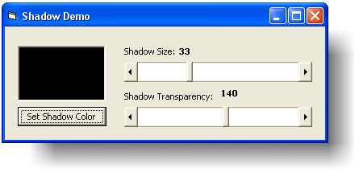



## Form Shadow \(Originally by Paul Caton\)

### Description

Originally by Paul Caton (txtCodeId=64867), this is a class that gives your forms a customizable shadow. Updated to use LaVolpe's revamped SelfSub (txtCodeId=68737) and adds support for Windows Vista and Windows 7.
 
### More Info
 

             |
---                |---
**Submitted On**   |2009-03-06 16:17:52
**By**             |[Joe Jordan](https://github.com/Planet-Source-Code/PSCIndex/blob/master/ByAuthor/joe-jordan.md)
**Level**          |Advanced
**User Rating**    |5.0 (55 globes from 11 users)
**Compatibility**  |VB 6\.0
**Category**       |[Custom Controls/ Forms/  Menus](https://github.com/Planet-Source-Code/PSCIndex/blob/master/ByCategory/custom-controls-forms-menus__1-4.md)
**World**          |[Visual Basic](https://github.com/Planet-Source-Code/PSCIndex/blob/master/ByWorld/visual-basic.md)
**Archive File**   |[Form\_Shado214610362009\.zip](https://github.com/Planet-Source-Code/joe-jordan-form-shadow-originally-by-paul-caton__1-71844/archive/master.zip)

